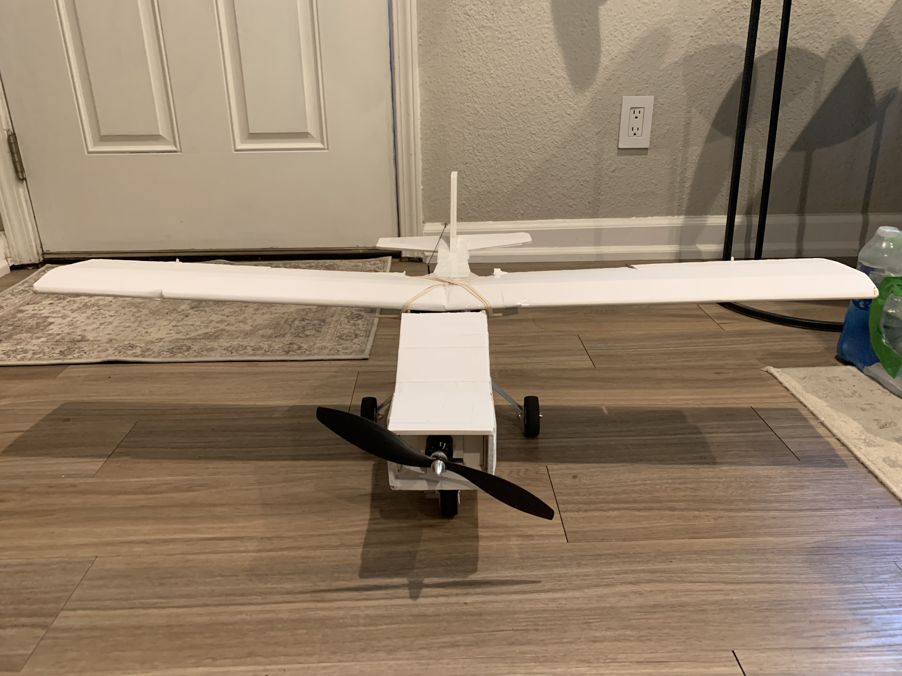
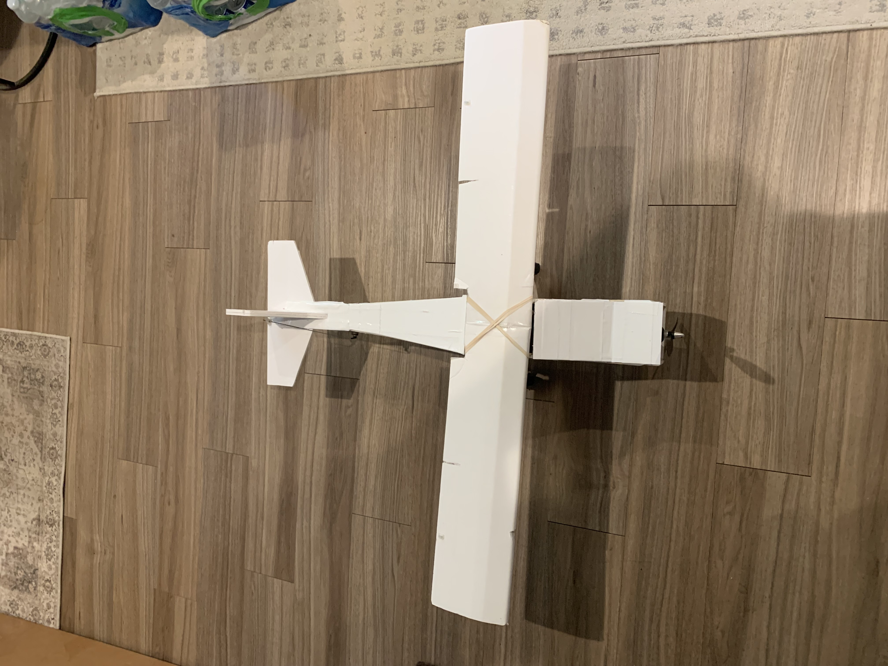
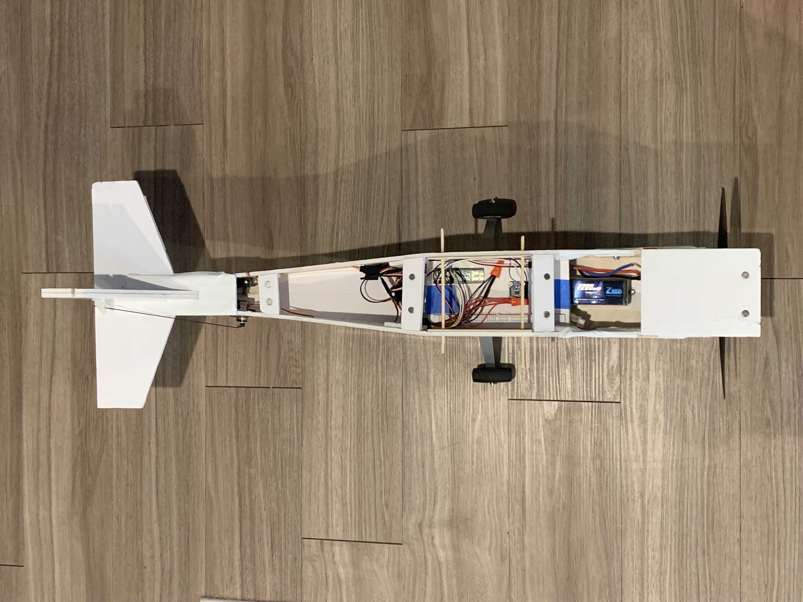
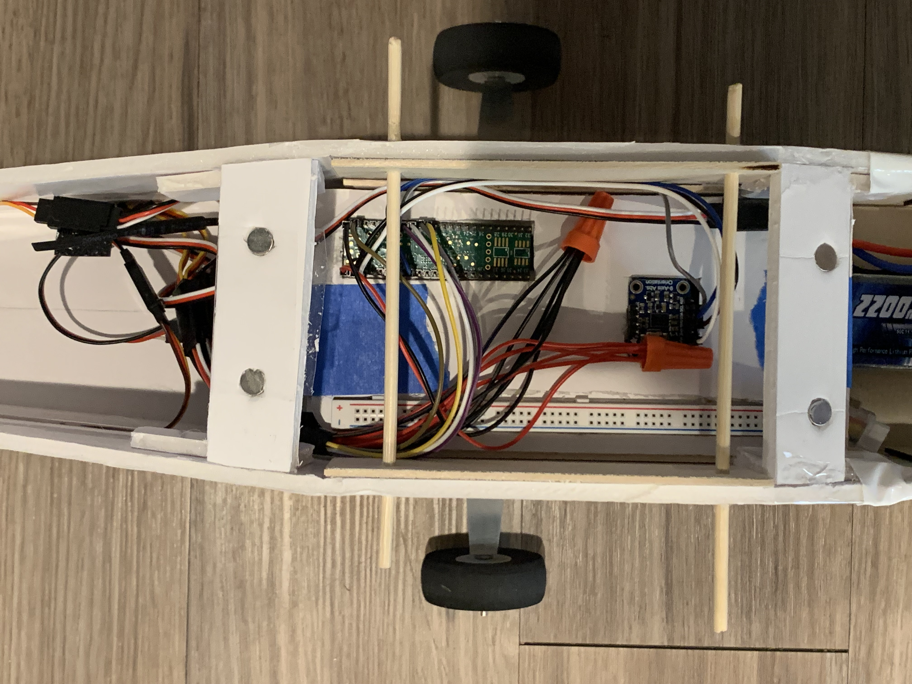
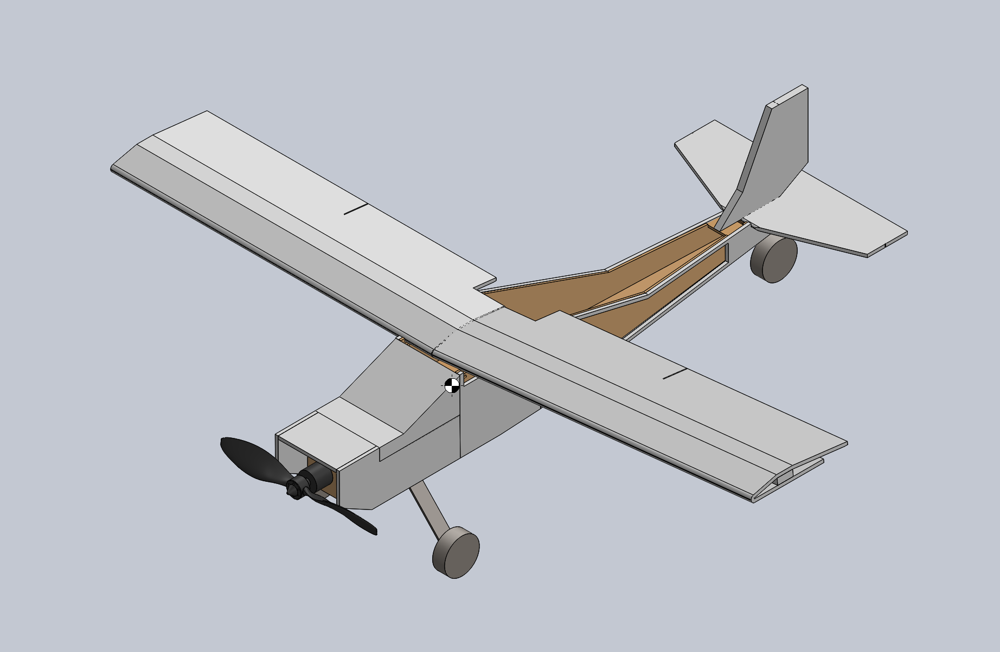
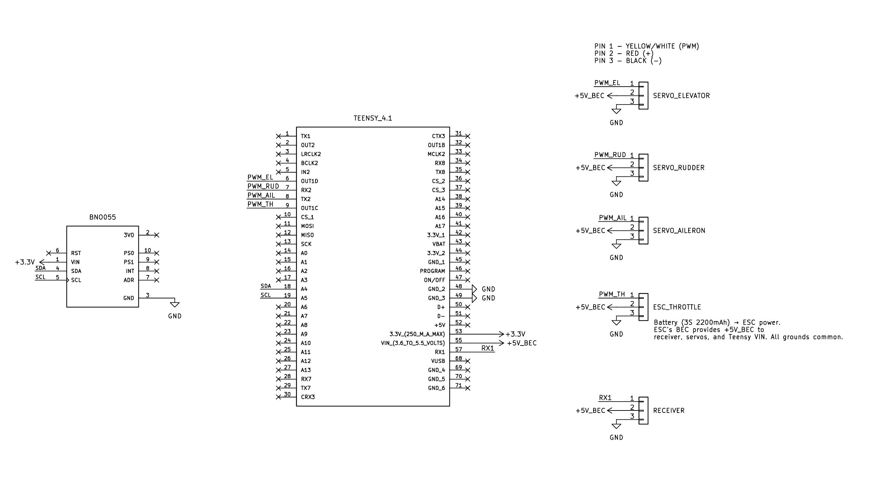

# Autonomous RC Airplane — Scratch-Built (Solo)

**Summary:** I designed and built an autonomous RC airplane from scratch-airframe, avionics, and control code—through bench/taxi tests and a few short flights, got basic stabilization working.

**Goal** — Build a reusable RC platform/system for autonomy.

**Approach** — Simple foamboard airframe with onboard control logic and SD-card logging. Signal flow: IMU + RC receiver → control laws on the microcontroller → mixer/override → servos/ESC. Tested and iterated using software-in-the-loop (SITL) and hardware-in-the-loop (HITL).

**Results** — Achieved liftoff and short controlled segments, validated the stabilization code, and created a platform for tuning and future iterations.

**What’s next** — Integrate airspeed sensing, add waypoint navigation, refine gains/control laws, and keep polishing the system.

## Quick Facts

| Area | Summary |
|---|---|
| Timeframe | May–Aug 2025 • Solo |
| Airframe | Foamboard + basswood; tricycle gear; ~30″ fuselage, ~40″ wingspan |
| Objective | Stabilized flight testbed for future autonomy |
| Control Architecture | IMU + RC receiver → control laws (PD/PID + state machine) → mixer/override → servos/ESC |
| Data | On-board logging (attitude + rates); MATLAB/Simulink SITL checks |
| Test Flow | Bench → Taxi → Flight; liftoff + short controlled segments |
| Toolchain | SolidWorks, Excel, Arduino IDE/C++, XFLR5, MATLAB/Simulink |

## Media

**Airframe:** Front and top-down views showing basic sizing, control surfaces, and tricycle-gear placement near the CG.

**Layout:** Battery/ESC up front with a removable avionics tray mid-bay for quick iteration.

**Avionics:** Microcontroller + IMU wiring paths; RC override and on-board logging.

**CAD:** Representative model used for sizing/mounts; the final build iterated from this geometry.

## Architecture

**Behavior notes**
- **Arming / Failsafe:** arms only after a short delay with throttle low and a good radio link; any disarm or radio loss cuts the throttle.
- **State machine:** modes are switch-driven (easy to drop back to MANUAL). Typical flow: IDLE → throttle ramp → elevator ramp → climb → cruise.
- **Override & Mixer:** in MANUAL, RC goes straight through. In some AUTO modes I blend manual input with the autopilot command and enforce trims/limits before sending PWM to the servos/ESC.

## Data Table Sample
Logging is implemented. See `data/sample.csv` for a short capture during **THROTTLE_RAMP**.  
Columns: `Time_ms, Phase, Pitch (deg), PitchRate (deg/s), Elevator (µs), Yaw (deg), YawRate (deg/s), Rudder (µs), Throttle (µs)`.

## Wiring Overview

**Power rails:** ESC BEC provides **+5V_BEC** to the receiver, servos, and Teensy VIN; the IMU is powered from the Teensy **3.3 V** rail. All grounds common.

**Signals:** `PWM_EL → pin 6`, `PWM_AIL → 7`, `PWM_RUD → 8`, `PWM_TH → 9`, `SDA/SCL → 18/19`, `iBUS → RX1`.

**Safety notes:** Avoid powering system from usb and battery at the same time

| Function            | Teensy pin | Connector pin      | Net      |
|---|---:|---|---|
| Elevator signal     | 6          | SERVO_ELEVATOR.1   | PWM_EL   |
| Aileron signal      | 7          | SERVO_AILERON.1    | PWM_AIL  |
| Rudder signal       | 8          | SERVO_RUDDER.1     | PWM_RUD  |
| ESC throttle signal | 9          | ESC_THROTTLE.1     | PWM_TH   |
| Receiver iBUS → RX1 | 0 (RX1)    | RECEIVER.1         | RX1      |
| I²C SDA / SCL       | 18 / 19    | BNO055 SDA / SCL    | SDA/SCL  |
| Power rails         | VIN / 3.3V  | +5V_BEC / 3.3V     | +5V_BEC / 3.3V |

## Code
All firmware lives in **/firmware**. It’s Arduino C++ for a Teensy 4.1 with a BNO055 IMU and iBus RC.  
Build notes and library list are in `/firmware/README.md`.

## What’s Next
- Add airspeed sensing (Pitot or inferred) and tune gains/gain scheduling.
- Logging polish (file rotation, timestamps, selected signals) and simple plotting notebook.
- Learning how to implement 3D printed components.
- Hardware: gear alignment, motor-mount reinforcement, cleaner wire routing.
- New airframe with different goal.

