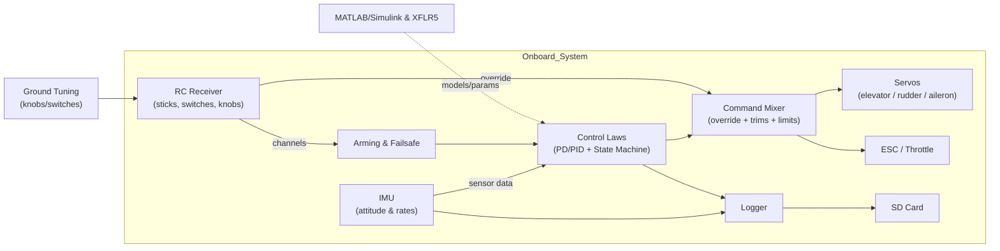

# Autonomous RC Airplane — Scratch-Built (Solo)

**Summary:** From a blank page to a working stabilization testbed: I designed and built an autonomous RC airplane from scratch—airframe, avionics, and control software—and iterated through bench, taxi, and flight tests to validate core stabilization and create a reusable platform for future autonomy.

**Goal** — Build a reusable RC platform for autonomy (stabilization today; cruise/waypoints next).

**Approach** — Simple foamboard airframe; onboard control architecture (microcontroller + IMU → control laws → RC override → servos/ESC) with on-board logging; staged testing (bench → taxi → flight); fast build–measure–learn cycles.

**Results** — Achieved liftoff and short controlled segments; validated stabilization; established a maintainable platform for systematic tuning and future iterations.

**What’s next** — Integrate airspeed sensing, refine gains/gain scheduling, add cruise hold, and expand logging/analysis for flight tuning.

## Quick Facts

| Area | Summary |
|---|---|
| Timeframe | May–Aug 2025 • Solo |
| Airframe | Foamboard, constant-chord wing; tricycle gear; ~30″ fuselage |
| Objective | Stabilized flight testbed for future autonomy |
| Control Architecture | MCU + IMU → control laws (PD/PID, state machine) → RC override → servos/ESC |
| Data | On-board logging (attitude + rates); MATLAB/Simulink SITL checks |
| Test Flow | Bench → Taxi → Flight; achieved liftoff + short controlled segments |
| Toolchain | SolidWorks, Excel, Arduino IDE/C++, XFLR5/XFOIL, MATLAB/Simulink |

## Media

**Airframe:** constant-chord foamboard wing; tricycle gear near CG for clean rotation and easy repair.

**Layout:** battery forward; removable avionics tray mid-bay; simple structure to speed iterations.

**Avionics:** microcontroller + IMU → control laws → RC override; on-board logging; removable skewer rails.

**CAD:** representative model used for sizing/mounts; the final build iterated from this geometry.

  
More photos

  

## Architecture

## Plots & Data

- **Data sample:** `data/sample.csv` (tiny, anonymized log—timestamps + attitude/rates).
- **Plot:** `plots/pitch_vs_time.png` (deg vs s).

*Plot hygiene:* one curve, labeled axes, units in ° and s.

## Code Snippet

See `/snippets/state_machine.cpp` — a compact state-machine skeleton with:
- RC override & arming/failsafe gate  
- Throttle/elevator timed ramps  
- PD pitch hold and cruise hold example

## What’s Next
- Add airspeed sensing (Pitot or inferred) and tune gains/gain scheduling.
- Cruise hold and cleaner phase transitions (climb → cruise).
- Logging polish (file rotation, timestamps, selected signals) and simple plotting notebook.
- Hardware: gear alignment, motor-mount reinforcement, wire strain relief.

## Repo Structure
.
├─ README.md
├─ /media            # photos & diagrams (PNG/JPG)
├─ /plots            # 1–2 figures (PNG)
├─ /data
│   └─ sample.csv    # tiny log snippet
├─ /snippets
│   └─ state_machine.cpp
├─ /docs             # optional notes
├─ LICENSE           # MIT (recommended)
└─ .gitignore        # Arduino/CAD patterns

